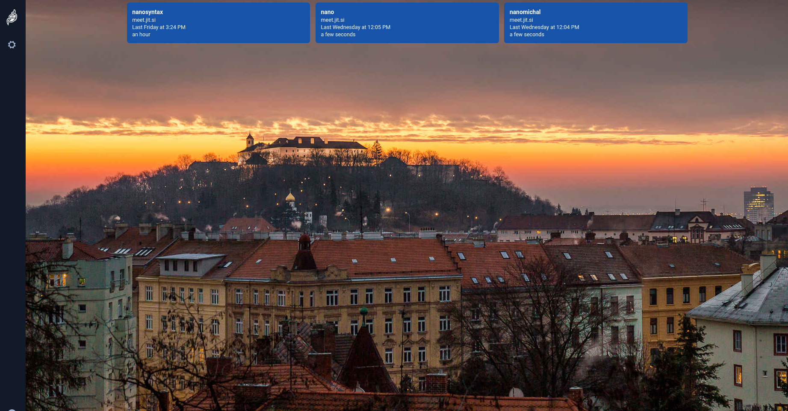

# Nanocentral Desktop App 

Desktop application for Nanosyntax built with [Electron].



## Installation 

Just download our [latest release] for macOS, Windows and GNU/Linux.

## Development

If you want to hack on this project, here is how you do it.

<details><summary>Show building instructions</summary>

#### Installing dependencies

```bash
npm install
```

#### Starting in development mode

```bash
npm start
```

#### Building the production distribution

```bash
npm run dist
```

#### Working with jitsi-meet-electron-utils

[jitsi-meet-electron-utils] is a helper package which implements many features
such as remote control and the always-on-top window. If new features are to be
added / tested, running with a local version of these utils is very handy, here
is how to do that.

By default the jitsi-meet-electron-utils is build from its git repository
sources. The default dependency path in package.json is:

```json
"jitsi-meet-electron-utils": "jitsi/jitsi-meet-electron-utils"
```

To work with local copy you must change the path to:

```json
"jitsi-meet-electron-utils": "file:///Users/name/jitsi-meet-electron-utils-copy",
```

To build the project you must force it to take the sources as `npm update` will
not do it.

```bash
npm install jitsi-meet-electron-utils --force
```

NOTE: Also check the [jitsi-meet-electron-utils README] to see how to configure
your environment.

</details>

## License

Apache 2. Inherited from [Jitsi Meet Electron] See the [LICENSE] file.


[Jitsi Meet]: https://github.com/jitsi/jitsi-meet
[Jitsi Meet Electron]: https://github.com/jitsi/jitsi-meet-electron
[Electron]: https://electronjs.org/
[latest release]: https://github.com/nanosyntax/nanocentral-electron/releases/latest
[jitsi-meet-electron-utils]: https://github.com/jitsi/jitsi-meet-electron-utils
[jitsi-meet-electron-utils README]: https://github.com/jitsi/jitsi-meet-electron-utils/blob/master/README.md
[LICENSE]: LICENSE
